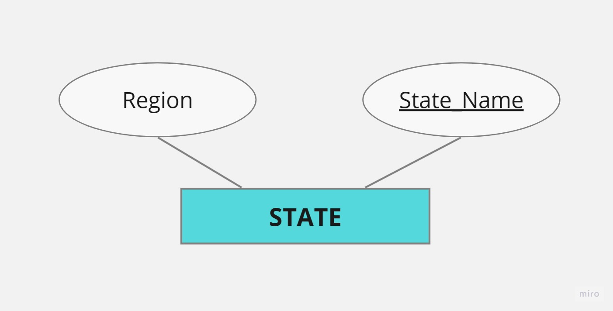
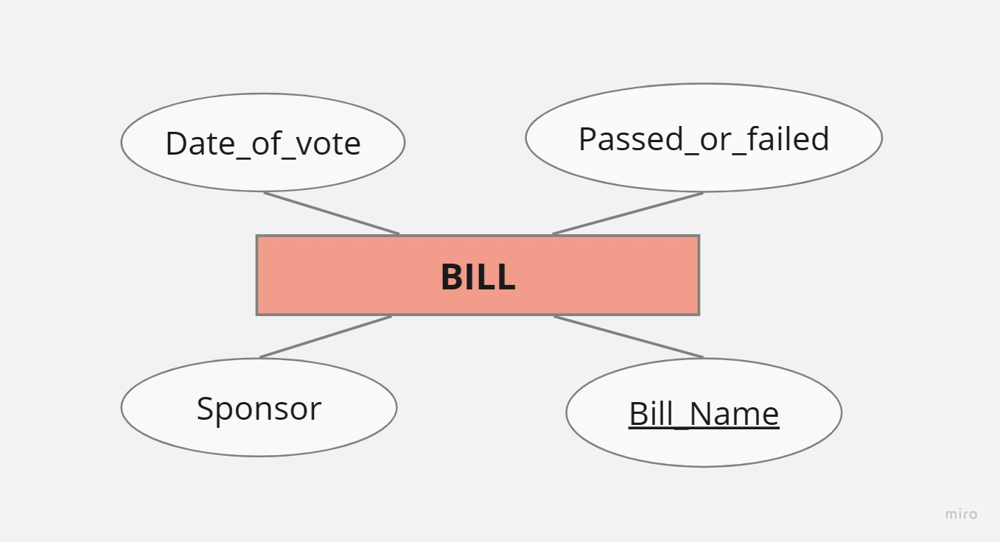

# Database Design Diagrams

- ## Entities :-

     ### [Congrees_Person]
    
     
     ### [State]
    
     
     ### [Bill]
    

- ## Entity Relational Diagram (ERD) :-

    

- ## Relational Model :-

    

